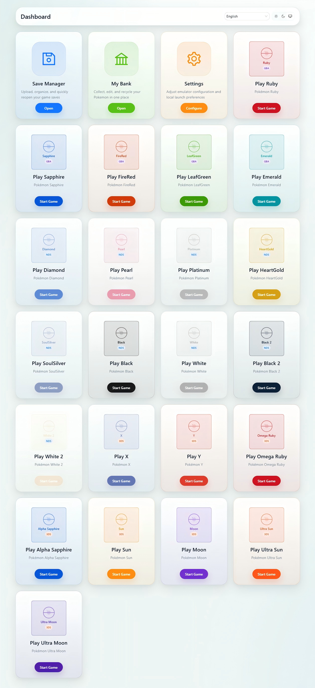
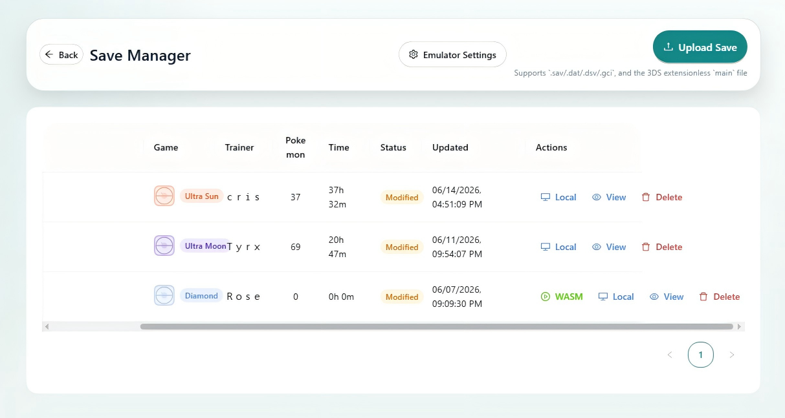
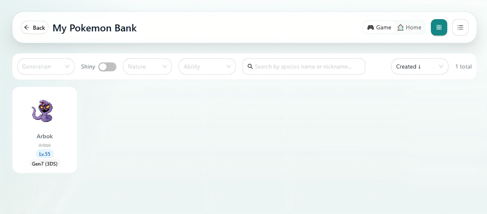
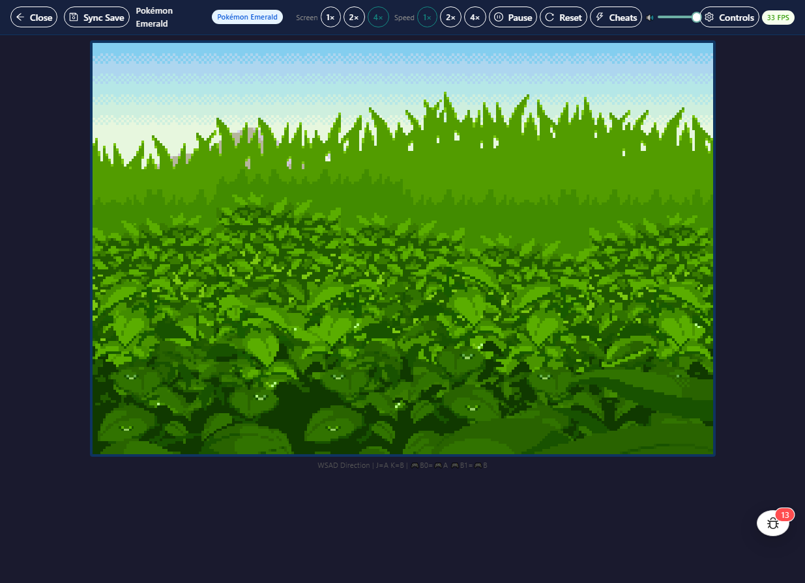
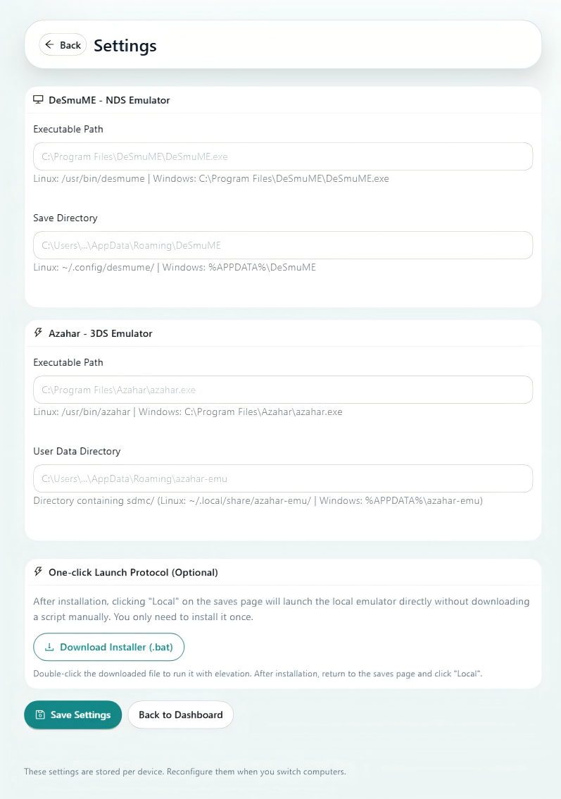

# PkManager — 全球热门IP抓宠对战游戏全世代存档管理平台

一个 B/S 架构的全栈 Web 应用，支持 **22 款全球热门IP抓宠对战游戏**（覆盖 **第三至第七世代**，GBA / NDS / 3DS）的存档上传、可视化、编辑与管理。基于 [PKHeX.Core](https://github.com/kwsch/PKHeX) 提供合法性感知的存档编辑，内置 GBA / NDS 在线模拟器（mGBA WASM + melonDS WASM），并通过本地 Azahar 模拟器集成 3DS 游戏。

> **当前开发范围**：Gen3–7（GBA / NDS / 3DS）。Gen8–9（Switch）仅保留元数据用于存档识别，编辑器和模拟器功能暂不开发。

---

## 功能概览

- **存档文件管理** — 上传、下载、导出、删除存档。5 槽位自动备份 + 一键恢复。
- **抓宠编辑器** — 7 个 Tab 面板（基本信息 / 能力值 / 招式 / 相遇 / 合法性 / 训练家杂项 / 外观装饰），编辑覆盖率 60%+，支持世代专属字段（LGPE AVs / LA GVs / Dynamax Level / 钛晶属性 / Alpha / Noble 等）。
- **合法性系统** — 三态判定（合法 / 存疑 / 非法）+ 逐字段指示 + 7 种 AutoFix 修复策略（球种、相遇地点、招式、回忆招式、特性、性格、闪光）。支持 QR 码生成供 3DS 实体机扫码注入。
- **背包编辑器** — 多口袋道具管理（15 种口袋类型，Capability 驱动显示）。
- **训练家编辑器** — OT 信息、徽章可视化点击切换、货币（金钱 / 代币 / BP / 联盟点数）、Game Sync ID、训练家卡片。
- **图鉴编辑器** — 已见 / 已捕获管理，批量操作（全部已见 / 全部捕获 / 全部清除），Gen4 扩展字段（性别、形态、晃晃斑斑点、语言标志）。
- **高级搜索** — 23 维度筛选，覆盖存档箱子与银行，支持保存/加载筛选器。
- **遭遇数据库** — 从 PKHeX 内置静态遭遇表搜索合法遭遇；应用约束或直接生成合法角色写入箱子。
- **一键进化** — 进化路径发现 + 分支选择（如伊布），支持通讯进化（自动设置交换状态）。
- **Showdown 导入导出** — 支持 Showdown / PokePaste 文本或 URL 导入，导出为标准 Showdown 格式。
- **世代专属工具** — Gen3 RTC 时钟编辑器、Gen6 O-Powers、Gen5 梦境世界查看器、Gen7 基格尔德细胞追踪。
- **跨存档存储（银行）** — 跨存档存储，批量移动、批量删除、批量导出（.zip）、合法性扫描、完整编辑。
- **GBA 在线模拟器（mGBA WASM）** — 浏览器内运行 Gen3 游戏，存档同步、即时存档、金手指（CodeBreaker）、变速、手柄支持、触屏手柄、AI 控制接口。
- **NDS 在线模拟器（melonDS WASM）** — 浏览器内运行 Gen4–5 游戏，双屏渲染、触摸屏覆盖层、存档同步。
- **NDS 本地模拟器（DeSmuME）** — 协议启动器 + 回退脚本调起本地 DeSmuME，存档注入、退出自动同步、本机存档恢复。
- **3DS 本地模拟器（Azahar）** — 协议启动器 + 回退脚本调起本地 Azahar（Citra 后继者），覆盖 8 款 Gen6–7 游戏。
- **错误诊断体系** — 全局 ErrorBoundary + 环形缓冲诊断存储（200 条）+ localStorage 持久化 + sendBeacon 自动上报后端 + 后端异常日志 + 一键健康检查脚本。
- **多语言国际化** — 10 种界面语言（简体中文、繁体中文、English、日本語、Français、Italiano、Deutsch、Español、Español Latinoamérica、한국어），服务端消息与客户端 UI 全覆盖。
- **暗色 / 亮色主题** — 一键切换 + 跟随系统，localStorage 持久化。
- **精灵图双风格** — 游戏像素风格（本地，~4 MB）和 Home 高清风格（CDN 懒加载），工具栏一键切换。

---

## 界面展示

### 控制台



### 存档管理



### 抓宠编辑器 & 银行



### 在线模拟器



### 系统设置



---

## 技术栈

| 层级 | 技术 |
|---|---|
| **后端** | ASP.NET Core 10 (.NET 10.0.300 LTS)、C# |
| **存档引擎** | PKHeX.Core v26.05.05（SDK 源码编译 → 本地 NuGet 包） |
| **前端** | React 19、TypeScript ~6.0、Vite 8、Ant Design 6 |
| **状态管理** | Zustand |
| **拖拽** | @dnd-kit |
| **数据库** | PostgreSQL 14.23（本地部署，非 Docker） |
| **数据访问** | Dapper + Npgsql（原生 SQL，snake_case → PascalCase 自动映射） |
| **认证** | JWT Bearer（HMAC-SHA256）+ BCrypt 密码哈希 |
| **GBA 模拟器** | mGBA WASM（@thenick775/mgba-wasm） |
| **NDS 模拟器** | melonDS WASM（Emscripten 5.0.7、SIMD + PThreads） |
| **本地 NDS 模拟器** | DeSmuME（GPLv2，协议启动器调起） |
| **本地 3DS 模拟器** | Azahar（GPLv2，Citra 后继者） |
| **国际化** | react-i18next（前端）+ JsonMessageLocalizer（后端） |

---

## 支持的游戏

| 世代 | 平台 | 游戏 |
|---|---|---|
| **第三世代** | GBA | 红宝石、蓝宝石、绿宝石、火红、叶绿 |
| **第四世代** | NDS | 钻石、珍珠、白金、心金、魂银 |
| **第五世代** | NDS | 黑、白、黑2、白2 |
| **第六世代** | 3DS | X、Y、欧米伽红宝石、阿尔法蓝宝石 |
| **第七世代** | 3DS | 太阳、月亮、究极之日、究极之月 |

---

## 快速开始

### 环境要求

- **.NET SDK** 10.0.300+（[下载](https://dotnet.microsoft.com/download/dotnet/10.0)）
- **Node.js** 20+ 和 **npm** 10+
- **PostgreSQL** 14（客户端工具：`psql`、`pg_ctl`、`initdb`）
- **Git**

### 1. 克隆仓库

```bash
git clone <repo-url> pkmanager
cd pkmanager
```

### 2. 编译 PKHeX.Core

项目从源码编译 PKHeX.Core 为本地 NuGet 包：

```bash
./scripts/update-pkhex-core-package.sh
```

### 3. 创建配置文件

```bash
cp config.dst config
```

编辑 `config`，设置真实的 `DB_PASSWORD`、`JWT_SECRET` 等敏感值。  
所有配置项均有默认值及文档说明——详见 `config.dst`。

### 4. 初始化数据库

```bash
# 首次启动脚本会自动执行 initdb，
# 也可手动初始化：
initdb -D data/pgdata --username=pkadmin --pwfile=<(echo "pkadmin123")
```

### 5. 启动开发环境

```bash
./scripts/start-dev.sh
```

此命令依次启动 PostgreSQL、.NET 后端（`:5000` / `:5001`）、Vite 前端（`:5173`）。

浏览器打开 **https://localhost:5173**（自签证书 — 点击"高级"→"继续访问"）。

### 6. 运行健康检查

```bash
./scripts/check-health.sh          # 全量检查（API + 诊断 + 冒烟测试）
./scripts/check-health.sh --quick  # 仅 API + 诊断
```

---

## 开发命令

```bash
# 全栈
./scripts/start-dev.sh              # 启动所有服务
./scripts/start-dev.sh --stop       # 停止所有服务

# 仅前端（cd client/）
npm run dev                         # Vite 开发服务器（:5173, HTTPS）
npm run build                       # TypeScript 类型检查 + 生产构建
npm run lint                        # ESLint 代码检查

# 仅后端（cd server/PkManager.Server/）
dotnet run --urls "http://0.0.0.0:5000"
dotnet build

# 数据库（本地 PostgreSQL）
psql -h data/pgdata/run -U pkadmin  # 连接运行中的数据库

# 静态数据种子（物种/招式/特性/性格/道具）
./scripts/seed-static-data.sh --lang zh-Hans
./scripts/seed-static-data.sh --lang all

# 升级 PKHeX.Core
cd sdk/PKHeX && git pull
./scripts/update-pkhex-core-package.sh
```

---

## 系统架构

```
浏览器 (React 19 + Vite 8 + Ant Design 6 + TypeScript)
  ├── Zustand stores (auth / resource / diagnostic / settings)
  ├── @dnd-kit (拖拽角色：箱子 ↔ 银行)
  ├── mGBA WASM — 浏览器内 GBA 模拟器（Gen3）
  ├── melonDS WASM — 浏览器内 NDS 模拟器（Gen4–5）
  ├── pkmanager:// 协议启动器 — 本地 DeSmuME (NDS) / Azahar (3DS)
  └── Axios → /api → ASP.NET Core 10 REST API
                         │
        ┌────────────────┼────────────────┐
        │                │                │
   Controllers      Services         Dapper + Npgsql → PostgreSQL 14
   (薄层，鉴权+      (业务逻辑)         (原生 SQL，snake_case→PascalCase)
    参数校验)
                         │
                    PKHeX.Core v26.05.05
                    SaveUtil、PKM、LegalityAnalysis
```

### 后端分层

- **Controllers** — 薄层：从 `UserContext` 提取当前用户，调用 Service，返回 `ApiResponse<T>`。共 9 个 Controller：Auth、SaveFile、Pokemon、Bank、Emulator、Resource、Settings、Diagnostics、Health。
- **Services** — 业务逻辑：AuthService（JWT + BCrypt）、ParseService（PKM ↔ DTO 映射）、SaveFileService（存档 CRUD + 背包 + 训练家）、PokemonEditService、BankService、SettingsService、LegalizationService。
- **Middleware** — ExceptionLoggingMiddleware（未处理异常 → `data/logs/backend-errors.jsonl`）、LanguageMiddleware（Accept-Language / 数据库偏好 / Query 参数三级解析）、Cross-Origin Isolation 响应头（SharedArrayBuffer 依赖）。
- **Data** — `DbConnectionFactory` 封装 Npgsql 连接。8 张核心表：`users`、`bank_pokemon`、`save_files`、`save_backups`、`rom_files`、`emulator_save_states`、`user_settings`、`res_*`（5 张静态数据表）。

### PKHeX 核心集成模式

存档以原始二进制数据存储（`save_files.raw_save_data` BYTEA + 文件系统 `data/saves/{userId}/{saveFileId}/save.sav`）。箱子中角色通过 `(boxIndex, slotIndex)` 定位，无独立数据库 ID。所有编辑通过 PKHeX.Core API 直接操作存档二进制。

### 模拟器架构

- **浏览器内（GBA/NDS）**：ROM 加载到 WASM 运行时 → 存档每 30 秒 + 页面关闭前 sendBeacon 自动同步。
- **本地启动（NDS/3DS）**：浏览器优先尝试 `pkmanager://launch/{token}` 协议 → 未安装则下载 shell/PowerShell 回退脚本 → 脚本备份本机存档 → 注入 pkmanager 存档（SHA-256 校验）→ 启动模拟器 → 等待退出 → POST 存档二进制回传 → 恢复本机旧存档。

---

## 配置说明

所有配置集中在项目根目录的 `config` 文件（gitignored，从 `config.dst` 模板复制）：

| 分类 | 配置键 | 说明 |
|---|---|---|
| **数据库** | `DB_HOST`、`DB_PORT`、`DB_NAME`、`DB_USER`、`DB_PASSWORD` | PostgreSQL 连接参数 |
| **JWT** | `JWT_SECRET`、`JWT_ISSUER`、`JWT_AUDIENCE`、`JWT_EXPIRE_HOURS`、`JWT_REFRESH_DAYS` | 身份认证 Token |
| **服务器** | `ASPNETCORE_URLS`、`Kestrel:CertPath`、`Kestrel:CertPassword` | Kestrel 端点与证书 |
| **前端** | `VITE_API_BASE_URL`、`VITE_HTTPS_KEY`、`VITE_HTTPS_CERT` | Vite 开发服务器 |
| **路径** | `ROM_IMPORT_DIRECTORY`、`DEFAULT_LANG` | 可选覆盖项 |

完整 16 项配置及双语（中/英）注释详见 `config.dst`。

---

## 项目目录结构

```
pkmanager/
├── certs/                    # TLS 证书（自签）
├── client/                   # React 19 前端
│   ├── public/
│   │   ├── assets/sprites/pokemon/  # 1025 张精灵图
│   │   ├── emulator/         # mGBA + melonDS WASM 运行时
│   │   └── scripts/          # 启动器脚本（供下载）
│   └── src/
│       ├── api/              # Axios API 层
│       ├── components/       # 通用组件 + editor/ + bank/
│       ├── constants/        # 游戏元数据（唯一数据源）
│       ├── i18n/             # 前端国际化
│       ├── lib/              # 模拟器封装 + 工具函数
│       ├── pages/            # 路由页面
│       └── stores/           # Zustand 状态管理
├── data/
│   ├── pgdata/               # PostgreSQL 14 数据目录
│   ├── saves/                # 存档文件（运行时）
│   └── logs/                 # 日志（运行时）
├── docs/                     # 技术文档
│   ├── TODOLIST.md           # 功能跟踪
│   └── archive/              # 已完成的归档设计文档
├── roms/                     # 游戏 ROM 文件
├── scripts/                  # 开发 & 部署脚本
├── sdk/                      # 外部工具源码（PKHeX / Azahar / DeSmuME）
├── server/
│   └── PkManager.Server/     # ASP.NET Core 10 后端
│       ├── Controllers/
│       ├── Services/
│       ├── Models/           # Entity / Request / Response
│       ├── Middleware/
│       ├── Helpers/
│       ├── Data/
│       └── Resources/        # 服务端本地化（10 种语言）
├── test-data/                # 测试存档
├── config                    # 统一配置（开发环境，gitignored）
└── config.dst                # 统一配置模板（已提交 Git）
```

---

## 路径规范

- 禁止在运行时代码中硬编码绝对路径（`/home/…`、`$HOME/…` 等）。
- 后端以 `IWebHostEnvironment.ContentRootPath`（即 `server/PkManager.Server/`）为路径基准。
- 前端与脚本以自身文件位置派生路径，不依赖进程当前工作目录。
- `SaveFileService` 是存档文件读写的唯一入口——Controller 层严禁直接操作存档文件。
- Shell 脚本使用 `PROJECT_DIR="$(cd "$(dirname "$0")/.." && pwd)"` 自定位。

---

## 许可证

本项目基于 **GPL-3.0-or-later** 协议发布。完整条款见 [LICENSE](LICENSE)。

---

## 问题反馈

使用过程中如遇到任何报错或异常行为，请 [提交 Issue]()：

- 复现步骤
- 浏览器及操作系统版本
- 相关报错信息（可通过 `Ctrl+Shift+D` 打开诊断面板查看）

---

## 致谢

- [PKHeX](https://github.com/kwsch/PKHeX) — 核心存档编辑库（GPLv3）
- [mGBA](https://mgba.io/) — GBA 模拟器（MPL 2.0）
- [melonDS](https://melonds.kuribo64.net/) — NDS 模拟器（GPLv3）
- [ds-anywhere](https://github.com/nickjackolson/ds-anywhere) — melonDS WASM 移植
- [Azahar](https://github.com/azahar-emu/azahar) — 3DS 模拟器（GPLv2，Citra 后继者）
- [DeSmuME](https://desmume.org/) — NDS 模拟器（GPLv2）
